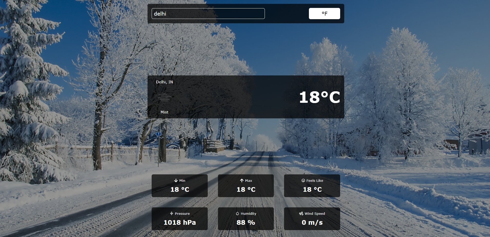

A Weather App

A Fully Responsive Weather App Using React Js. 

## Images





## Prerequisites

Before you begin, ensure you have met the following requirements:

* [Git](https://git-scm.com/downloads "Download Git") must be installed on your operating system.

## Installing

To install, follow these steps:

Linux and macOS:

```bash
sudo git clone https://github.com/khanimran17/weather-app.git
```

Windows:

```bash
git clone https://github.com/khanimran17/weather-app.git
```